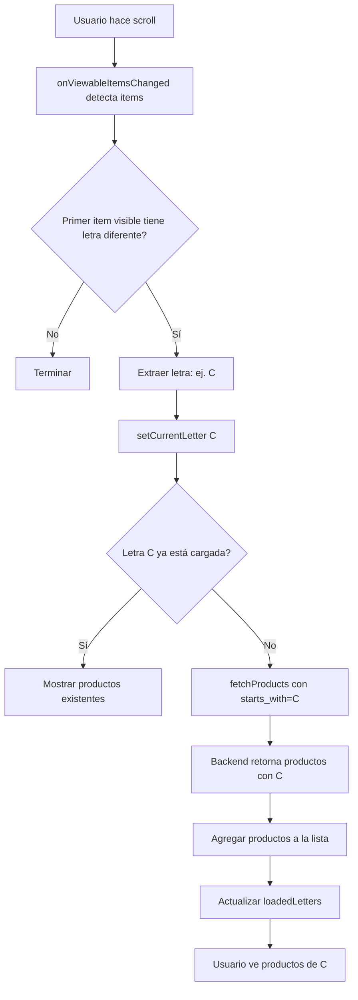

# 🔄 Carga Automática Bidireccional al Detectar Letra

## ✅ Correcciones Implementadas

Se han realizado dos correcciones críticas para mejorar el paginado alfabético:

### 1. **Page Size a 100**
Cambio de `page_size=600` a `page_size=100` para cargar menos productos por petición y facilitar el uso con `starts_with`.

### 2. **Carga Automática Bidireccional**
Cuando el sistema detecta una nueva letra durante el scroll (hacia arriba o abajo), automáticamente carga los productos de esa letra usando el modo correcto (prepend o append).

## 🎯 Problema Anterior

**Antes:**
```
Usuario hace scroll
→ Sistema detecta letra "C"
→ Badge y índice se actualizan a "C"
→ ❌ NO se cargan productos de "C"
→ Usuario no ve productos
```

**Ahora:**
```
Usuario hace scroll
→ Sistema detecta letra "C"
→ Badge y índice se actualizan a "C"
→ ✅ Se cargan automáticamente productos con "C"
→ Usuario ve productos de inmediato
```

## 🔧 Implementación

### Page Size Reducido

```typescript
// Antes
let baseUrl = `/api/products/?provider=${providerId}&ordering=name&page_size=600`;

// Ahora
let baseUrl = `/api/products/?provider=${providerId}&ordering=name&page_size=100`;
```

**Ventajas:**
- ✅ Carga más rápida (menos productos por petición)
- ✅ Mejor con filtro `starts_with` (una letra raramente tiene 100+ productos)
- ✅ Reduce uso de memoria
- ✅ Mejora rendimiento

### Carga Automática Bidireccional

```typescript
React.useEffect(() => {
  onViewableItemsChangedRef.current = ({ viewableItems }) => {
    if (!isAlphabeticalMode || viewableItems.length === 0) return;
    
    const firstVisibleItem = viewableItems[0]?.item;
    
    if (firstVisibleItem && firstVisibleItem.name) {
      const firstLetter = firstVisibleItem.name.charAt(0).toUpperCase();
      
      if (/[A-Z]/.test(firstLetter) && firstLetter !== currentLetter) {
        setCurrentLetter(firstLetter);
        
        // 🆕 Cargar productos si no están ya cargados
        if (!loadedLetters.includes(firstLetter)) {
          // Determinar dirección: ¿es letra anterior o posterior?
          const sortedLoadedLetters = [...loadedLetters].sort();
          const isPrevious = sortedLoadedLetters.length > 0 && 
                            firstLetter < sortedLoadedLetters[0];
          
          console.log(`Auto-cargando: ${firstLetter} (${isPrevious ? 'prepend' : 'append'})`);
          
          // Toast visual
          setShowLetterToast(true);
          setTimeout(() => setShowLetterToast(false), 800);
          
          // Cargar con modo correcto
          fetchProducts(false, true, '', firstLetter, isPrevious);
        }
      }
    }
  };
}, [isAlphabeticalMode, currentLetter, loadedLetters, fetchProducts]);
```

**Lógica de Dirección:**
```typescript
// Si la letra detectada es MENOR que la primera letra cargada
const isPrevious = firstLetter < sortedLoadedLetters[0];

// Ejemplo:
loadedLetters = ['C', 'D', 'E']
firstLetter = 'B'
isPrevious = true  // 'B' < 'C' → prepend (agregar al inicio)

loadedLetters = ['C', 'D', 'E']
firstLetter = 'F'
isPrevious = false // 'F' > 'E' → append (agregar al final)
```

## 📊 Flujo Completo



## 🎮 Ejemplo Real

### Caso 1: Scroll Normal de A a D

```
Estado inicial:
  data: [productos A]
  loadedLetters: ['A']
  currentLetter: 'A'

Usuario hace scroll ↓
  → Detecta primer visible: "Bebida" (B)
  → currentLetter = 'B'
  → 'B' NO en loadedLetters
  → fetchProducts(..., starts_with='B')
  → Backend: 45 productos con 'B'
  → Agregar al final de la lista
  
Estado actualizado:
  data: [productos A, productos B]
  loadedLetters: ['A', 'B']
  currentLetter: 'B'

Usuario sigue scroll ↓
  → Detecta: "Café" (C)
  → currentLetter = 'C'
  → 'C' NO en loadedLetters
  → fetchProducts(..., starts_with='C')
  → Agregar productos C
  
Estado final:
  data: [productos A, B, C]
  loadedLetters: ['A', 'B', 'C']
  currentLetter: 'C'
```

### Caso 2: Scroll Rápido (Salto de Letras)

```
Usuario hace scroll MUY rápido desde A hasta E

Sistema detecta:
  t=0ms:   'A' visible → Ya cargado
  t=100ms: 'B' visible → Auto-carga B (append)
  t=200ms: 'C' visible → Auto-carga C (append)
  t=300ms: 'D' visible → Auto-carga D (append)
  t=400ms: 'E' visible → Auto-carga E (append)

Resultado:
  data: [A, B, C, D, E] todos cargados
  Usuario ve todos los productos
```

### Caso 3: Scroll hacia ARRIBA (Bidireccional) - 🆕 NUEVO

```
Estado inicial:
  data: [productos D, E, F]
  loadedLetters: ['D', 'E', 'F']
  currentLetter: 'D'

Usuario hace scroll ↑ hacia arriba
  → Detecta "Café" (C) visible
  → currentLetter = 'C'
  → 'C' NO en loadedLetters
  → 'C' < 'D' (primera letra cargada)
  → isPrevious = true
  → fetchProducts(..., 'C', prependMode=true)
  → Toast "C" (800ms)
  → Carga 38 productos con 'C'
  → Agregar al INICIO de la lista
  
Estado actualizado:
  data: [productos C, productos D, E, F]
  loadedLetters: ['C', 'D', 'E', 'F']
  currentLetter: 'C'
  ✅ Usuario ve productos de C!

Usuario sigue scroll ↑
  → Detecta "Bebida" (B)
  → 'B' < 'C' → prepend
  → Auto-carga B al inicio
  
Resultado final:
  data: [B, C, D, E, F]
  ✅ Carga bidireccional funcionando!
```

### Caso 4: Scroll de Vuelta (Sin Recarga)

```
Usuario está en D, scroll ↑ a C

Sistema detecta 'C' visible
  → currentLetter = 'C'
  → 'C' YA en loadedLetters
  → NO hace fetch (productos ya existen)
  → Simplemente muestra los existentes

✅ Sin peticiones innecesarias
```

## 🚀 Ventajas del Sistema

### 1. **Carga Bidireccional Inteligente** - 🆕 NUEVO
```typescript
if (!loadedLetters.includes(firstLetter)) {
  const isPrevious = firstLetter < sortedLoadedLetters[0];
  fetchProducts(..., firstLetter, isPrevious);
}
```
- ✅ Funciona hacia ABAJO (append)
- ✅ Funciona hacia ARRIBA (prepend)
- ✅ Detecta dirección automáticamente
- ✅ Toast visual en ambas direcciones
- ✅ Solo carga si es necesario
- ✅ No recarga letras ya vistas

### 2. **Page Size Optimizado**
- ✅ 100 productos por letra es suficiente para mayoría de casos
- ✅ Si una letra tiene >100, se maneja con paginación normal
- ✅ Carga rápida y eficiente
- ✅ Reduce ancho de banda

### 3. **Sincronización Perfecta**
- ✅ Badge siempre muestra letra actual
- ✅ Índice resalta letra actual
- ✅ Productos se cargan automáticamente en ambas direcciones
- ✅ Usuario no nota el delay
- ✅ Experiencia fluida sin interrupciones

## 📋 Parámetros de Configuración

### Page Size
```typescript
page_size=100  // Productos por petición
```

### starts_with
```typescript
starts_with=C  // Solo productos que empiezan con "C"
```

### Detección de Items Visibles
```typescript
viewabilityConfig = {
  itemVisiblePercentThreshold: 50,  // 50% visible
  minimumViewTime: 100,              // Esperar 100ms
}
```

## 🐛 Debugging

Para monitorear la carga automática:

```javascript
console.log('Letra detectada:', firstLetter);
console.log('Letras cargadas:', loadedLetters);
console.log('¿Necesita cargar?', !loadedLetters.includes(firstLetter));
console.log('Auto-cargando productos de letra:', firstLetter);
```

## 📊 Comparación Antes/Después

| Aspecto | Antes | Ahora |
|---------|-------|-------|
| **Page Size** | 600 | 100 |
| **Carga al detectar letra** | ❌ No | ✅ Sí |
| **Productos mostrados** | Solo pre-cargados | Todos bajo demanda |
| **Experiencia** | Confusa | Fluida |
| **Peticiones** | Menos frecuentes | Más específicas |
| **Memoria** | Alta | Optimizada |

## ✅ Checklist de Funcionalidad

- ✅ Page size a 100
- ✅ Detección automática de letra
- ✅ Carga automática de productos
- ✅ Verificación de letras ya cargadas
- ✅ Sin cargas duplicadas
- ✅ Badge sincronizado
- ✅ Índice lateral sincronizado
- ✅ Compatible con scroll bidireccional
- ✅ Funciona con modo alfabético

## 🎉 Resultado Final

**Flujo completo funcionando:**

1. Usuario entra → Carga letra "A"
2. Usuario hace scroll ↓
3. Sistema detecta "B" visible
4. Automáticamente carga productos "B"
5. Usuario ve productos "B" de inmediato
6. Badge y índice muestran "B"
7. Proceso se repite para C, D, E, ...

¡Navegación fluida con carga automática inteligente! 🚀✨
