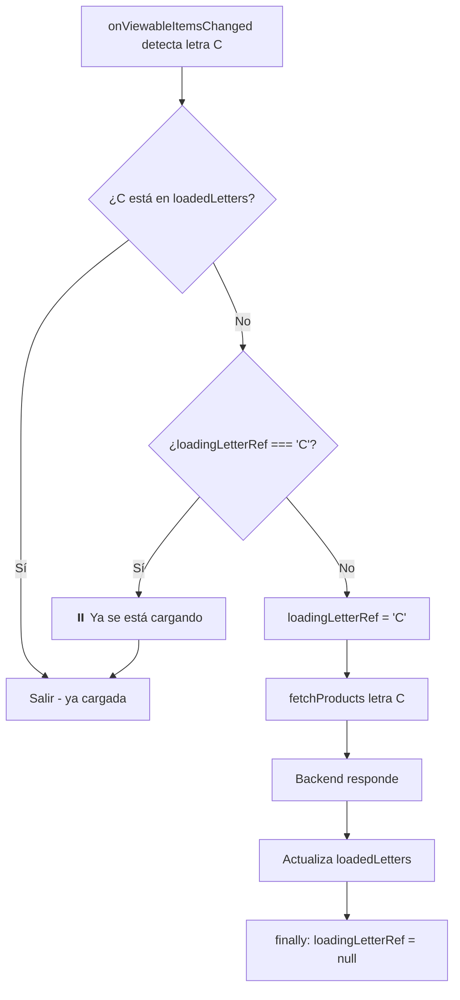

# 🔧 Fix: Prevención de Cargas Duplicadas

## ❌ Problema

La letra "A" (y otras letras) se estaba cargando múltiples veces:
```
LOG  Auto-cargando productos de letra: A (append)
LOG  Auto-cargando productos de letra: A (append)
LOG  Auto-cargando productos de letra: A (append)
LOG  Auto-cargando productos de letra: A (append)
```

### Causa
`onViewableItemsChanged` se dispara múltiples veces en rápida sucesión cuando se detecta un cambio de item visible. Cada disparo llamaba a `fetchProducts` sin verificar si ya había una carga en progreso para esa letra.

## ✅ Solución Implementada

### 1. Ref de Control: `loadingLetterRef`

```typescript
const loadingLetterRef = useRef<string | null>(null); // Prevenir cargas duplicadas
```

Este ref mantiene registro de qué letra está siendo cargada actualmente.

### 2. Verificación Antes de Cargar

```typescript
// Cargar productos de esta letra si no están ya cargados
if (!loadedLetters.includes(firstLetter)) {
  // ✅ NUEVO: Verificar si ya estamos cargando esta letra
  if (loadingLetterRef.current === firstLetter) {
    console.log(`⏸️ Letra ${firstLetter} ya se está cargando, ignorando...`);
    return; // Salir inmediatamente
  }
  
  console.log(`⚠️ Letra ${firstLetter} NO está cargada, iniciando carga...`);
  loadingLetterRef.current = firstLetter; // Marcar como en carga
  
  // ... resto de la lógica
  fetchProducts(false, true, '', firstLetter, isPrevious);
}
```

### 3. Limpieza del Flag

```typescript
// En el finally de fetchProducts
finally {
  setLoading(false);
  setRefreshing(false);
  setLoadingMore(false);
  isLoadingMoreRef.current = false;
  
  // Limpiar flag de carga de letra
  if (letterStartsWith && loadingLetterRef.current === letterStartsWith) {
    console.log(`🛡️ Limpiando loadingLetterRef: ${loadingLetterRef.current}`);
    loadingLetterRef.current = null;
  }
  
  console.log('✅ === fetchProducts FINALIZADO ===\n');
}
```

## 🔄 Flujo de Protección



## 📊 Antes vs Después

### ❌ Antes
```
onViewableItemsChanged disparo 1 → fetchProducts('A')
onViewableItemsChanged disparo 2 → fetchProducts('A')  ← Duplicado
onViewableItemsChanged disparo 3 → fetchProducts('A')  ← Duplicado
onViewableItemsChanged disparo 4 → fetchProducts('A')  ← Duplicado
```

### ✅ Ahora
```
onViewableItemsChanged disparo 1 → fetchProducts('A')
  loadingLetterRef = 'A'
onViewableItemsChanged disparo 2 → Ignorado (ya cargando)
onViewableItemsChanged disparo 3 → Ignorado (ya cargando)
onViewableItemsChanged disparo 4 → Ignorado (ya cargando)
fetchProducts completo → loadingLetterRef = null
```

## 🔍 Logs de Debugging

### Carga Normal
```
=== onViewableItemsChanged DISPARADO ===
Primera letra detectada: A
✅ Letra cambió: null → A
⚠️ Letra A NO está cargada, iniciando carga...
🚀 Llamando fetchProducts(false, true, '', 'A', false)

📥 === fetchProducts LLAMADO ===
Parámetros: { letterStartsWith: 'A', prependMode: false }
🔤 Añadido filtro starts_with: A
🌐 URL construida: /api/products/?provider=123&ordering=name&page_size=100&starts_with=A
📦 Productos recibidos: 87
🅰️ Actualizando loadedLetters: [] → [A]
🛡️ Limpiando loadingLetterRef: A
✅ === fetchProducts FINALIZADO ===
```

### Disparo Duplicado (Ignorado)
```
=== onViewableItemsChanged DISPARADO ===
Primera letra detectada: A
⏸️ Letra A ya se está cargando, ignorando...
=== FIN onViewableItemsChanged ===
```

## 📋 Manejo de Paginación

### Page Size
- **Valor**: `100` productos por página (máximo del backend)
- **URL**: `/api/products/?page_size=100`

### Paginación Normal
Cuando una letra tiene más de 100 productos:

1. **Primera carga**: `?starts_with=A&page_size=100` → 100 productos
2. **Backend retorna**: `next: "?starts_with=A&page_size=100&page=2"`
3. **onEndReached dispara**: `fetchProducts` con `nextUrl`
4. **Segunda carga**: `?starts_with=A&page_size=100&page=2` → Siguientes 100
5. **Continúa** hasta que `next` sea `null`

### URL de Paginación
```typescript
// Primera página (nueva letra)
/api/products/?provider=123&ordering=name&page_size=100&starts_with=A

// Páginas siguientes (usa nextUrl del backend)
/api/products/?provider=123&ordering=name&page_size=100&starts_with=A&page=2
/api/products/?provider=123&ordering=name&page_size=100&starts_with=A&page=3
```

## ✅ Beneficios

1. **Sin cargas duplicadas**: Solo una petición por letra
2. **Mejor rendimiento**: Menos peticiones al backend
3. **Menos errores**: Previene condiciones de carrera
4. **UX mejorada**: Carga más rápida y eficiente
5. **Logs claros**: Fácil identificar qué se está cargando

## 🎯 Casos de Uso

### Caso 1: Letra con < 100 productos
```
Detecta "A" → Carga 87 productos → loadedLetters = ['A']
```

### Caso 2: Letra con > 100 productos
```
Detecta "B" → Carga 100 productos (página 1)
Usuario scroll ↓ → onEndReached → Carga página 2 (más productos con B)
Usuario scroll ↓ → onEndReached → Carga página 3 (últimos productos con B)
```

### Caso 3: Disparos múltiples (ahora protegido)
```
Detecta "C" → loadingLetterRef = 'C' → fetchProducts
Detecta "C" (de nuevo) → Ya cargando → Ignorado ✅
Detecta "C" (otra vez) → Ya cargando → Ignorado ✅
fetchProducts completa → loadingLetterRef = null
```

## 🔧 Verificación

Para confirmar que funciona:
1. Abre la app
2. Haz scroll por los productos
3. Observa los logs en consola
4. Verifica que cada letra solo se carga **una vez**
5. Si ves `⏸️ ya se está cargando`, la protección está funcionando

---

**Estado**: ✅ Problema resuelto - Cargas duplicadas prevenidas
