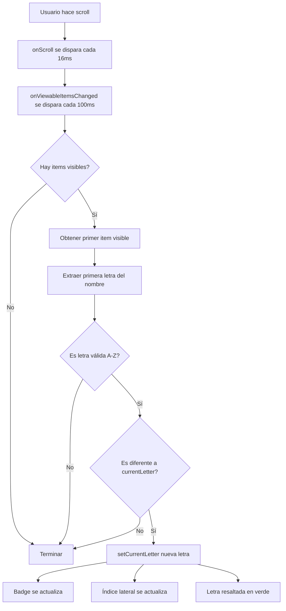

# 📍 Seguimiento en Vivo de Letra Actual

## ✨ Nueva Funcionalidad

El índice alfabético lateral ahora **se actualiza automáticamente** mientras haces scroll, resaltando en verde la letra de los productos que estás viendo actualmente.

## 🎯 Cómo Funciona

### Detección Automática
```
Usuario hace scroll por la lista
       ↓
FlatList detecta qué items están visibles
       ↓
Obtiene el primer producto visible
       ↓
Extrae su primera letra
       ↓
Actualiza currentLetter
       ↓
Índice lateral resalta letra en verde
```

## 📱 Experiencia Visual

```
Scroll en "B"                Scroll en "D"
┌──────────────────┐        ┌──────────────────┐
│ Letra: B      [A]│        │ Letra: D      [A]│
│               [B]│◄─ Verde│               [B]│
│               [C]│        │               [C]│
│ 📦 Bebida     [D]│        │               [D]│◄─ Verde
│ 📦 Bolsas     [E]│        │ 📦 Detergente [E]│
│               [.]│        │ 📦 Dulces     [.]│
│               [Z]│        │               [Z]│
└──────────────────┘        └──────────────────┘

Badge actualizado            Badge actualizado
    ↓                            ↓
"Letra: B"                   "Letra: D"
```

## 🔧 Implementación Técnica

### Handler de Items Visibles (useRef)

```typescript
// Configuración estable
const viewabilityConfigRef = useRef({
  itemVisiblePercentThreshold: 50, // 50% del item debe ser visible
  minimumViewTime: 100,             // Esperar 100ms antes de considerar
});

// Handler estable usando useRef
const onViewableItemsChangedRef = useRef(({ viewableItems }) => {
  if (!isAlphabeticalMode || viewableItems.length === 0) return;
  
  const firstVisibleItem = viewableItems[0]?.item;
  
  if (firstVisibleItem && firstVisibleItem.name) {
    const firstLetter = firstVisibleItem.name.charAt(0).toUpperCase();
    
    if (/[A-Z]/.test(firstLetter) && firstLetter !== currentLetter) {
      setCurrentLetter(firstLetter);
    }
  }
});

// Actualizar handler cuando cambien las dependencias
React.useEffect(() => {
  onViewableItemsChangedRef.current = ({ viewableItems }) => {
    // ... lógica actualizada con dependencias actuales
  };
}, [isAlphabeticalMode, currentLetter]);
```

### FlatList Configurado

```tsx
<FlatList
  onViewableItemsChanged={onViewableItemsChangedRef.current}
  viewabilityConfig={viewabilityConfigRef.current}
  scrollEventThrottle={16}
  // ... otros props
/>
```

### ⚠️ Importante: Por qué useRef

React Native requiere que `onViewableItemsChanged` sea **estable** y no cambie entre renders. Si usas `useCallback` o una función normal, causará este error:

```
ERROR: Changing onViewableItemsChanged nullability on the fly is not supported
```

**Solución:** Usar `useRef` para mantener la referencia estable y actualizar `.current` en un `useEffect`.

## 📊 Parámetros de Detección

| Parámetro | Valor | Significado |
|-----------|-------|-------------|
| `itemVisiblePercentThreshold` | 50% | Item debe estar 50% visible |
| `minimumViewTime` | 100ms | Esperar antes de actualizar |
| `scrollEventThrottle` | 16ms | Frecuencia de eventos de scroll |

## 🎮 Comportamiento Detallado

### Caso 1: Scroll Normal
```
Productos visibles:
  - Bebida (50% visible)
  - Bolsas (100% visible)
  - Banana (70% visible)

Primer item visible: Bebida
Primera letra: "B"
Acción: currentLetter = "B"
Índice lateral: [B] resaltado en verde
Badge: "Letra: B"
```

### Caso 2: Scroll Rápido
```
Usuario hace scroll rápido B → C → D

FlatList detecta cada 100ms:
  t=0ms:   Primer visible = Bebida → "B"
  t=100ms: Primer visible = Café → "C"
  t=200ms: Primer visible = Detergente → "D"

Resultado: Índice va cambiando B → C → D
```

### Caso 3: Transición entre Letras
```
Lista actual: [...B, ...C, ...]
Usuario en frontera B/C

50% de "Bolsas" (B) visible + 50% de "Café" (C) visible
→ Primer visible = "Bolsas"
→ Letra = "B"

Usuario sigue bajando
→ "Café" ahora 50% visible
→ Primer visible = "Café"
→ Letra = "C" ✓ Cambia automáticamente
```

### Caso 4: Scroll hacia Arriba
```
Usuario estaba en "D", hace scroll ↑

FlatList detecta:
  Primer visible cambia: D → C → B

Índice se actualiza automáticamente:
  [D] verde → [C] verde → [B] verde
```

## 🎨 Sincronización Visual

### Estados Sincronizados

```typescript
{
  currentLetter: 'C',           // Letra actual detectada
  loadedLetters: ['A','B','C'], // Letras cargadas
  data: [                       // Productos en memoria
    { name: "Aceite" },         // A
    { name: "Arroz" },          // A
    { name: "Bebida" },         // B
    { name: "Café" },           // C ← Primer visible
    { name: "Canela" },         // C
  ]
}
```

### Componente de Índice

```tsx
{Array.from('ABCDEFGHIJKLMNOPQRSTUVWXYZ').map((letter) => {
  const isAvailable = availableLetters.includes(letter);
  const isActive = currentLetter === letter; // ← Se actualiza automáticamente
  
  return (
    <Pressable
      style={{
        backgroundColor: isActive ? '#10b981' : 'transparent', // Verde si activa
      }}
    >
      <Text style={{
        color: isActive ? '#ffffff' : '#1f2937' // Blanco si activa
      }}>
        {letter}
      </Text>
    </Pressable>
  );
})}
```

## 📍 Indicadores Múltiples

La letra actual se muestra en **3 lugares simultáneamente**:

1. **Badge en Header**
   ```tsx
   {currentLetter && (
     <View className="bg-emerald-100">
       <Text>Letra: {currentLetter}</Text>
     </View>
   )}
   ```

2. **Índice Lateral**
   ```tsx
   <View style={{ backgroundColor: isActive ? '#10b981' : 'transparent' }}>
     <Text>{letter}</Text>
   </View>
   ```

3. **Toast Temporal** (solo al cambiar de letra)
   ```tsx
   {showLetterToast && currentLetter && (
     <View>
       <Text style="7xl">{currentLetter}</Text>
     </View>
   )}
   ```

## 🔄 Flujo Completo de Actualización



## 🚀 Ventajas del Sistema

### 1. **Feedback Visual Inmediato**
- ✅ Usuario siempre sabe en qué letra está
- ✅ No necesita adivinar su posición
- ✅ Orientación clara en listas largas

### 2. **Sincronización Automática**
- ✅ No requiere tocar el índice
- ✅ Actualización en tiempo real
- ✅ Funciona con cualquier tipo de scroll

### 3. **Rendimiento Optimizado**
- ✅ Solo actualiza si la letra cambia
- ✅ Throttle de 100ms evita actualizaciones excesivas
- ✅ useRef evita re-renders innecesarios

### 4. **Consistencia**
- ✅ Badge y índice siempre sincronizados
- ✅ Funciona con scroll bidireccional
- ✅ Compatible con carga automática de letras

## 📋 Configuración Opcional

### Ajustar Sensibilidad

Para cambiar cuándo se considera un item "visible":

```typescript
const viewabilityConfigRef = useRef({
  itemVisiblePercentThreshold: 75, // ← Cambiar a 75% (más estricto)
  minimumViewTime: 50,              // ← Cambiar a 50ms (más rápido)
});
```

### Ajustar Frecuencia de Scroll

```tsx
<FlatList
  scrollEventThrottle={32} // ← Cambiar a 32ms (menos frecuente)
/>
```

## 🐛 Debugging

Para monitorear la detección:

```javascript
console.log('Items visibles:', viewableItems.length);
console.log('Primer visible:', firstVisibleItem?.name);
console.log('Letra detectada:', firstLetter);
console.log('Letra actual:', currentLetter);
console.log('¿Cambió letra?:', firstLetter !== currentLetter);
```

## ✅ Checklist de Funcionalidad

- ✅ Detecta primer item visible
- ✅ Extrae primera letra
- ✅ Actualiza currentLetter automáticamente
- ✅ Badge muestra letra actual
- ✅ Índice lateral resalta letra actual
- ✅ Funciona con scroll hacia abajo
- ✅ Funciona con scroll hacia arriba
- ✅ No causa re-renders excesivos
- ✅ useRef mantiene handler estable
- ✅ Compatibilidad con modo alfabético

## 🎉 Resultado Final

El seguimiento en vivo de letra está **completamente funcional**:

1. **Haces scroll** por la lista
2. **Primer producto visible** determina la letra
3. **Badge** muestra "Letra: X"
4. **Índice lateral** resalta [X] en verde
5. **Actualización automática** mientras scrolleas

¡Navegación alfabética con feedback visual en tiempo real! 📍✨
